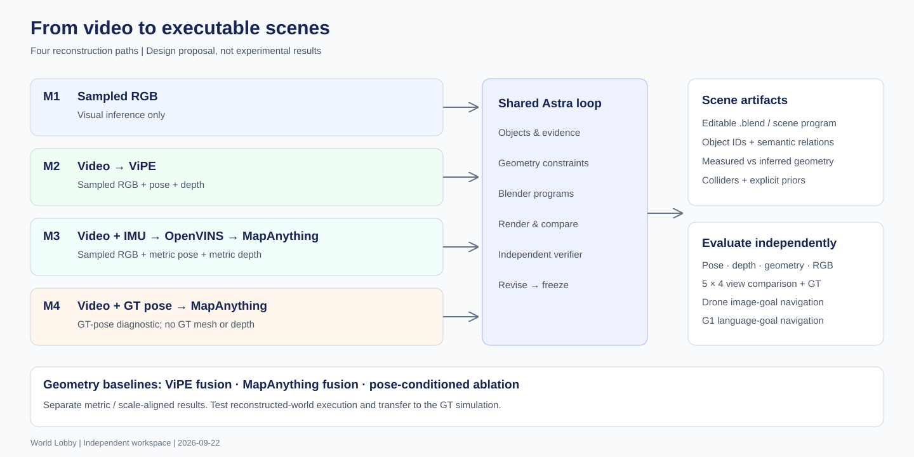
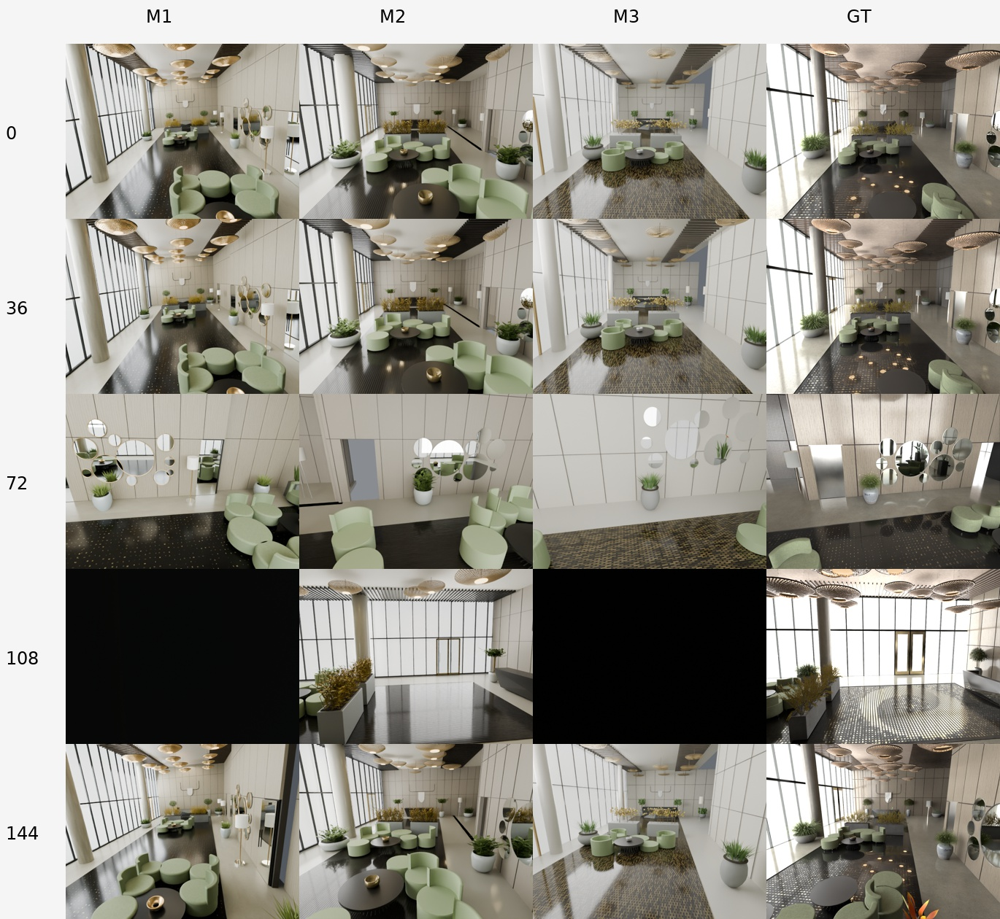
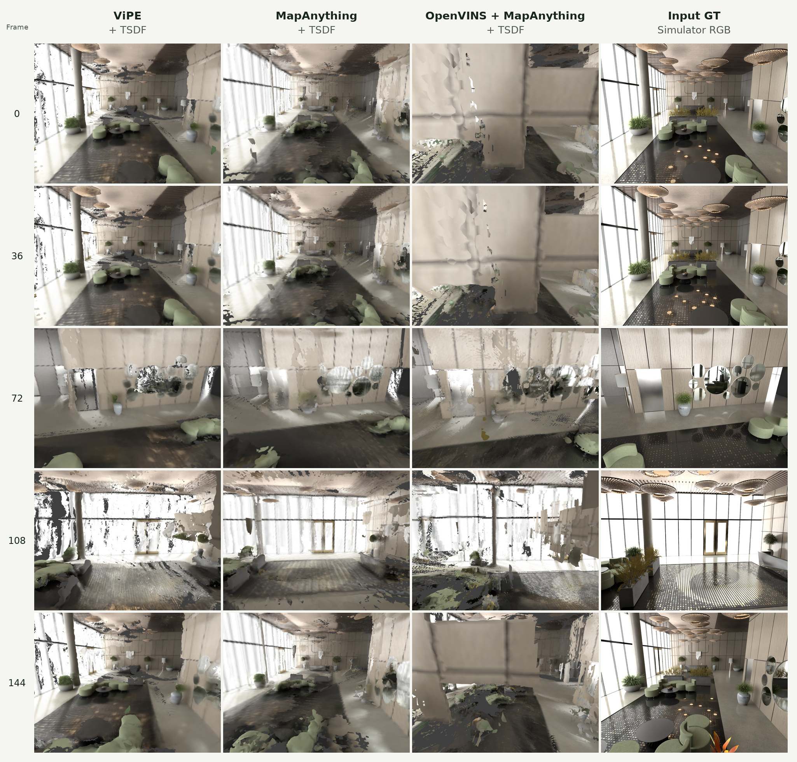
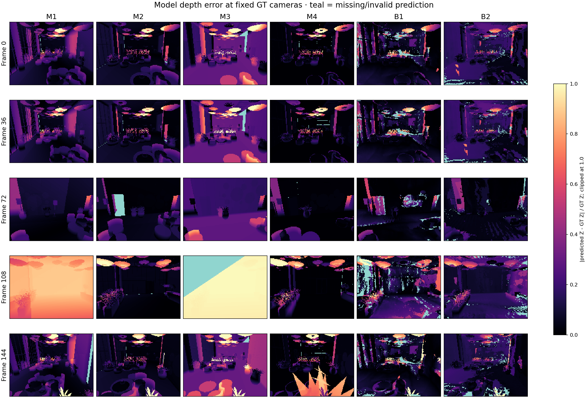
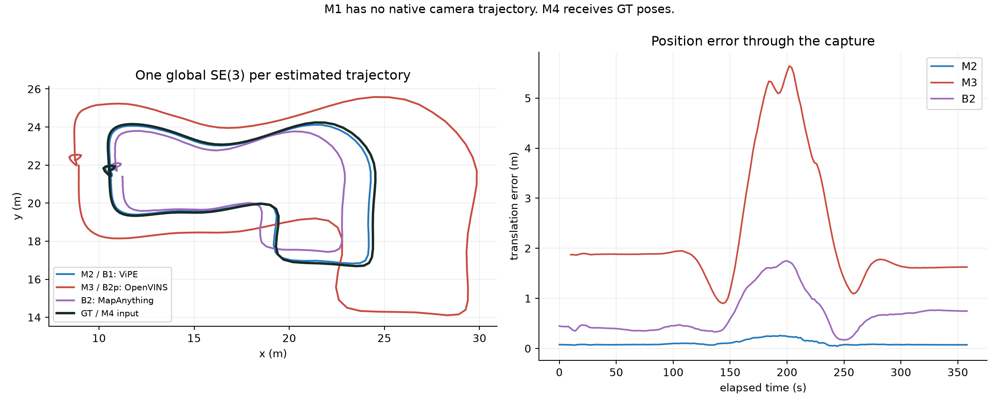
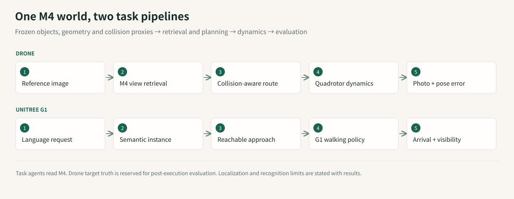
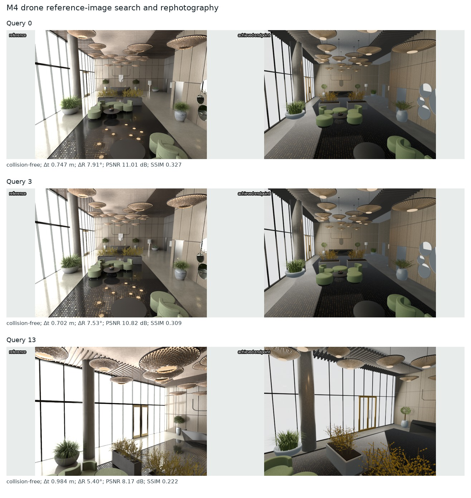
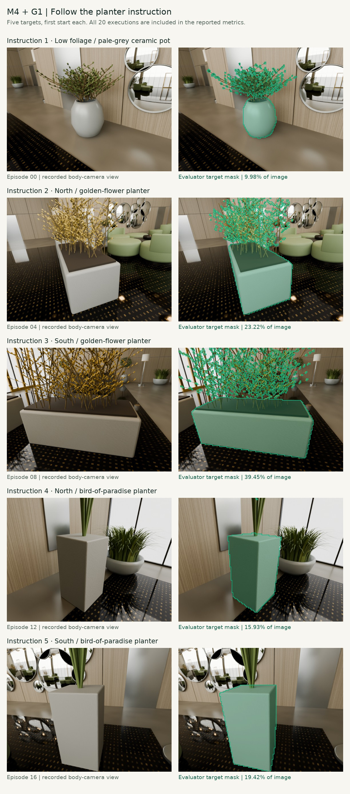

# When the map becomes a program

## A measured experiment with GPT‑6 Astra, Blender, and executable 3D worlds

Could a map also be a design file, a geometric measurement, and a robot's working environment?

We gave GPT‑6 Astra images and different amounts of geometric evidence, then used Blender as its construction and rendering tool. The resulting scenes contain editable geometry, materials, named elements, spatial relations, cameras, and collision proxies. A shared artifact connects visual interpretation, measured constraints, scene editing, and simulated action.

Two findings coexist. **A general visual coding model can turn observations into structured, executable assets. It also inherits localization errors and can build plausible structures in the wrong places.** With ground-truth camera poses, mean model-to-GT surface distance was 6.9 cm. With this capture's OpenVINS poses, it was 45.9 cm. The downstream experiments now both use M4 to test language-goal navigation and reference-image rephotography; reaching a candidate region and reproducing a photograph are different requirements.

This is one static simulated lobby, with one engineering run per method and an unequal historical budget for the RGB-only model. It exposes useful mechanisms and failures; it does not establish cross-scene superiority or industry replacement.

## Four paths from one capture

World Lobby provides approximately 360 seconds of synthetic observations: 8,999 RGB frames at 25 Hz, 1280×960 pixels, and 89,999 synchronized IMU samples at 250 Hz. Taking every 50th RGB frame gives 180 modelling views.

Fresh Astra sessions independently constructed M2, M3, and M4 using method-specific packets. Builders and independent verifiers could inspect their permitted inputs and generated scenes, but not GT geometry or evaluation results. M4 alone received GT camera poses. Historical M1 remained frozen.

Table 1. Four reconstruction routes and their inputs

| Method | Available observations | Geometric evidence | Scene construction |
|---|---|---|---|
| M1 · RGB-only + Astra | 180 sampled RGB images | Visually inferred dimensions | Astra calls Blender |
| M2 · ViPE + Astra | Full video; sampled measurements | ViPE poses and near-metric depth | Astra calls Blender |
| M3 · OpenVINS + MapAnything + Astra | Video, IMU, calibration | OpenVINS metric poses → MapAnything depth | Astra calls Blender |
| M4 · GT pose + MapAnything + Astra | Video and GT camera poses | GT poses → MapAnything depth | Astra calls Blender |

**M1 asks how far visual interpretation goes.** Without measured depth or camera motion, its dimensions have no recovered metric scale. Display and shape evaluation use one disclosed GT-assisted Sim(3) registration, with scale approximately 0.690, derived from four frozen presentation-camera associations.

**M2 adds measured video geometry.** This ViPE run is RGB-only. GeoCalib initializes intrinsics; DROID-style learned monocular SLAM, frontend/backend bundle adjustment, and non-keyframe pose infill estimate the trajectory while optimizing intrinsics. UniDepth V2 small (`lpiccinelli/unidepth-v2-vits14`) supplies the keyframe depth prior and learned near-metric scale. No IMU, external poses, or GT scale are supplied.

Final depth uses `adaptive_unidepth-s`: the implementation selects direct UniDepth depth when the minimum projected-map coverage score across the trajectory is below 0.3, or PriorDA prompted by sparse SLAM depth otherwise. An independent reproduction from the frozen map and camera files gives a minimum coverage score of 0.79, above the 0.3 threshold: the 180 sampled depths therefore use **PriorDA prompted by SLAM depth**, with UniDepth V2 small supplying the upstream keyframe prior. This is a `no_vda` run without Video Depth Anything. ViPE processes all 8,999 frames; Astra and B1 consume the same 180 sampled outputs. Near-metric scale remains an empirical prediction, not a guarantee.

**M3 adds inertial constraints.** OpenVINS consumes calibrated, synchronized camera and IMU observations. MapAnything receives RGB, intrinsics, and its metric cam2world poses. Initialization began around 8.6 seconds, leaving 175 of the 180 sampled poses. Those missing inputs remain missing. The implemented chain is **RGB + calibrated intrinsics + OpenVINS metric camera-to-world poses → MapAnything optical-Z depth → Astra / Blender**. All 175 packet poses match OpenVINS outputs, and depth arrays pass unchanged into the modelling packet. MapAnything pose and scale conditioning are enabled without GT scale correction. The evaluated trajectory remains the OpenVINS output; MapAnything does not write poses back to it.

**M4 removes estimated-pose error.** It receives camera answers, but no GT depth, mesh, or object inventory. This is a diagnostic condition, not a deployable method or a theoretical upper bound on scene quality.

MapAnything used joint four-view windows with overlap two; an eight-view attempt exceeded memory and is excluded. A fixed centrality rule resolves repeated outputs, and pose-conditioned fusion uses the supplied camera frame. We also evaluate B1, ViPE+TSDF, and B2, calibrated RGB-only MapAnything+TSDF. Supplementary B2p fuses exactly the OpenVINS+MapAnything measurements supplied to M3. Four scene-building routes plus two primary fusion baselines make **six main systems**.

## A scene program, with explicit limits

M2–M4 share a modelling contract: inspect permitted inputs, organize objects and constraints, write and execute Blender code from an empty scene, render input views, obtain independent review, make bounded repairs, and freeze. Reviewers see only the method's permitted inputs and model, never GT geometry. The common cap is **five complete scene versions and 60 checking renders**; version counts include the initial build.

Actual use differs: M2 produced **five versions (initial + four revisions), with 25 checking renders**; M3 **three versions (initial + two revisions), with 15 renders**; M4 **four versions (initial + three revisions), with 20 renders**. Each version checks five views, selected separately by each modeller: 0/65/85/110/130 for M2, 5/60/90/105/126 for M3, and 0/60/90/108/138 for M4. These internal checking views also differ from the five common final-evaluation views.

All four methods have **180 available RGB reference images**; they are not necessarily submitted to Astra in a single request. File access is distinct from visual inspection. M2's analysis program reads 180 RGB files. M3 records 111 RGB frame IDs under mixed contact-sheet, visual-inspection and SIFT-triangulation purposes. M4 reads 180 RGB files programmatically and separately records 34 personally inspected RGB frames. File-read counts do not establish how many images Astra individually viewed. Historical M1 has no verifiable visual-access or revision count.

Thus **M2–M4 share the workflow contract and budget cap, but not identical evidence use, checking views, or iteration counts; M1 lacks the same budget constraint.** This is a single-run comparison of engineering routes, not an otherwise identical input-only ablation. Independent reviews repaired furniture intersections, surface orientation, missing objects, and collider coverage; remaining errors stayed in the frozen artifacts.

Named elements can be selected, edited, or queried. Their names are generated interpretations, not semantic accuracy measurements. M3's 259 elements include 195 trim or structural-detail elements; they are not 259 verified physical object instances. We have not independently annotated object correspondence.

M3 supplies 52 hard collision proxies. Unknown regions and vegetation exclusions constrain planning without becoming physical walls. Mass, friction, hidden joints, and material response are not independently recovered from this video. Execution under stated assumptions is a narrower claim than physical fidelity.

## Five fixed views

Rows are keyframes 0, 36, 72, 108, and 144; the five columns are RGB-only + Astra, ViPE + Astra, OpenVINS + MapAnything + Astra, GT pose + MapAnything + Astra, and original simulator RGB (input GT). Each row uses the same target camera and intrinsics after one global registration, without per-image fitting.

M1's black frame 108 remains visible. It is a camera/model coverage failure, not an image to replace with a flattering viewpoint. These images reproduce modelling views; they do not establish held-out-image generalization.

Direct fusion retains observed colors as well as holes and ghost geometry. Columns show ViPE + TSDF, MapAnything + TSDF, OpenVINS + MapAnything + TSDF, and input GT:

## Four measurements, not one score

Camera translation uses ATE RMSE; rotation uses angular RMSE. Metric and near-metric methods receive a single global SE(3) alignment, inherited by their models without ICP. M1's GT-assisted Sim(3) is explicitly separate. Depth is optical-axis Z; AbsRel averages absolute relative error over valid predictions inside an independently defined GT domain.

**Bold** marks the best displayed value in each metric column; ties at the shown precision are all bold. ↓ Lower is better; ↑ higher is better. GT inputs and missing values are excluded.

Table 2. Camera-pose and depth errors for four reconstruction methods and three fusion baselines

| System | ATE (m) ↓ | Rotation (°) ↓ | Native depth AbsRel ↓ | Model depth AbsRel ↓ |
|---|---|---|---|---|
| M1 · RGB-only + Astra / Sim(3)† | — | — | — | 21.68% |
| M2 · ViPE + Astra | **0.118** | **0.312** | **7.38%** | 10.58% |
| M3 · OpenVINS + MapAnything + Astra | 2.595 | 1.116 | 26.12% | 32.00% |
| M4 · GT pose + MapAnything + Astra | GT input | GT input | 10.68% | **7.54%** |
| B1 · ViPE + TSDF | **0.118** | **0.312** | **7.38%** | 13.03% |
| B2 · MapAnything + TSDF | 0.791 | 0.735 | 18.41% | 16.81% |
| B2p · OpenVINS + MapAnything + TSDF | 2.595 | 1.116 | 26.12% | 64.79% |

**Evaluation frame counts for Table 2.** Pose errors use 180 sampled poses for M2/B1 and B2, and 175 available poses for M3/B2p. M1 has no native trajectory; M4 receives GT poses, so neither is assigned an estimated-pose error. Both depth metrics use a domain of 180 fixed views with 19,200 sampled pixels per frame. M3/B2p provide native depth for 175 frames, while the other frontends provide 180; every final model is raycast at all 180 GT cameras. AbsRel averages valid predictions only; Table 3 coverage and the separate missing-prediction penalty account for missing output. The five-view figures are for visualization. B2p shares M3's poses and native depth but uses direct TSDF fusion in place of Astra modelling.

Model depth is evaluated at all 180 GT cameras. Native M3 depth retains its initialization gap. AbsRel must be read together with coverage:

Table 3. Coverage of sampled camera poses and depth

| System | Sampled pose coverage ↑ | Native depth coverage ↑ | Model depth coverage ↑ |
|---|---|---|---|
| M1 · RGB-only + Astra | — | — | 99.71% |
| M2 · ViPE + Astra | **100.00%** | **100.00%** | 99.40% |
| M3 · OpenVINS + MapAnything + Astra | 97.22% | 95.91% | 99.19% |
| M4 · GT pose + MapAnything + Astra | — | 98.57% | **99.87%** |
| B1 · ViPE + TSDF | **100.00%** | **100.00%** | 94.75% |
| B2 · MapAnything + TSDF | **100.00%** | 98.37% | 97.06% |
| B2p · OpenVINS + MapAnything + TSDF | 97.22% | 95.91% | 93.61% |

**How is coverage computed?** Sampled pose coverage is the number of sampled frames with an estimated pose divided by 180. Native depth coverage measures usable depth produced directly by ViPE or MapAnything; model depth coverage measures usable depth obtained by raycasting the final reconstructed geometry at the common GT cameras. Both depth coverages divide usable predictions inside the valid GT domain by the number of valid GT samples. We sample 19,200 fixed pixel positions per frame: 3,456,000 valid GT positions across 180 frames here. GT optical-axis depth must be finite and within 0.1–30 m; predicted depth must be finite and positive, with native depth also passing its validity mask and sampling checks. Missing frames remain in the denominator.

For OpenVINS + MapAnything + Astra, pose coverage is 175 / 180 = 97.22%, native depth coverage is 95.91%, and model depth coverage is 99.19%. **Coverage measures availability, not accuracy or whole-scene surface completeness.** A misplaced wall can still return depth, so depth and geometry errors must be considered alongside coverage. M1 has no native pose/depth estimate; M4 receives GT poses. Inapplicable entries are shown as “—”.

The downloadable report includes RMSE, δ1, and MAE with a 30 m penalty for each missing prediction. On the common 175-frame subset, native depth AbsRel is 7.36% for M2, 26.12% for M3, 10.47% for M4, and 18.36% for B2.

Geometry uses 100,000 area-sampled model points and exact nearest GT triangles. The reverse observed-GT distance samples fixed GT image-ray hits: it is observation-weighted, not surface-area-weighted. Whole-building reverse distances, including unobserved structures, are separately retained in the raw reports.

Table 4. Geometry and input-view appearance errors

| System | Model → GT (m) ↓ | Observed GT → model (m) ↓ | PSNR (dB) ↑ | SSIM ↑ |
|---|---|---|---|---|
| M1 · RGB-only + Astra | 0.306 | 0.337 | 9.48 | 0.263 |
| M2 · ViPE + Astra | 0.182 | 0.195 | 12.20 | 0.342 |
| M3 · OpenVINS + MapAnything + Astra | 0.459 | 0.736 | 10.06 | 0.265 |
| M4 · GT pose + MapAnything + Astra | **0.069** | **0.074** | 12.59 | 0.344 |
| B1 · ViPE + TSDF | 0.453 | 0.211 | **15.57** | **0.457** |
| B2 · MapAnything + TSDF | 0.470 | 0.395 | 13.72 | 0.370 |

**How Table 4 is computed.** Model → GT averages the exact nearest-triangle distance from 100,000 area-weighted model-surface samples to GT. Observed GT → model averages the reverse distance from 100,000 sampled valid GT ray hits across 180 views. The former measures surface displacement; the latter measures omissions in the observed region. Both are in metres, lower is better.

PSNR/SSIM use **five input views: 0, 36, 72, 108, and 144**. Predictions are 640×480; GT is downsampled from 1280×960 with Lanczos. Rendering uses fixed GT views after the single global registration, with no per-image pose, color, or exposure fitting. For RGB normalized to [0,1], per-view `MSE = mean((predicted RGB − GT RGB)²)` and `PSNR = −10 log10(MSE)`. SSIM uses scikit-image's 7×7 uniform window, `K1=0.01`, `K2=0.03`, and `data_range=1`, averaged across RGB channels. Each reported score is the arithmetic mean of five per-view scores. PSNR includes every pixel; SSIM uses the library's default border handling, with no additional validity mask. Black frames and holes remain included.

**Why does B1 lead PSNR/SSIM?** B1 fuses observed RGB into TSDF mesh vertex colors, rendered with an unlit emission material and the Standard color transform. Astra models instead generate materials and use scene lighting. Because these evaluation views belong to the input observations, B1 benefits from directly reusing observed colors. Its 15.57 dB / 0.457 describes better appearance reproduction at these seen views; color reuse and rendering differences have not been separated by ablation. Its Model → GT distance is 0.453 m, versus M4's 0.069 m. **Appearance similarity is not geometric accuracy. This table does not measure held-out RGB generalization or isolate material, lighting, and renderer effects.**

The paired M3/B2p comparison also resists a single winner. Astra reduces model-to-GT distance from 1.032 m to 0.459 m and rendered-depth AbsRel from 64.79% to 32.00%. But observed-GT-to-model distance increases from 0.676 m to 0.736 m. Object construction can suppress noisy surfaces while omitting observed ones.

Relative error is clipped at 1.0 for display; teal marks missing or invalid predictions.

## Pose errors propagate

M2 and B1 share ViPE cameras; M3 and B2p share OpenVINS; M4 uses the GT path. M1 has no native estimated trajectory. A later RGB-COLMAP diagnostic is not an Astra output. Drawing six independent estimated curves would misrepresent the pipelines.

Increasing OpenVINS history from 11 to 31 improved early behavior in this slow orbit without fixing mid-sequence drift. Under first-pose alignment, position error is approximately 1.02 cm at 60 seconds and 6.79 m at 180 seconds. The main table instead reports whole-sequence best rigid alignment, giving 2.595 m ATE. These are different diagnostic definitions.

Replacing estimated poses with GT poses reduces final-model depth AbsRel from 32.00% to 7.54%. Pose quality is an important bottleneck here. Because M3 and M4 are separate single agent runs, their difference is not a noise-free causal estimate.

Twenty supplementary views are deterministic perturbations of the same simulated trajectory. Each uses 5,000 fixed random rays (seed 23) cast directly into the independent GT triangle mesh, with the same cameras and rays for every frozen model. This tests same-scene novel-pose depth, not a new scene or independent capture. Legacy rendered Z failed numerical BVH validation and is excluded; novel-view RGB is unscored because of renderer differences.

Table 5. Depth errors at novel viewpoints in the same scene

| System | Novel depth AbsRel ↓ | RMSE (m) ↓ | Coverage ↑ | Penalized MAE (m) ↓ |
|---|---|---|---|---|
| M1 · RGB-only + Astra | 19.45% | 2.195 | 99.66% | 1.399 |
| M2 · ViPE + Astra | 10.39% | 1.186 | 99.42% | 0.783 |
| M3 · OpenVINS + MapAnything + Astra | 30.58% | 2.397 | 99.25% | 2.035 |
| M4 · GT pose + MapAnything + Astra | **7.47%** | **1.146** | **99.88%** | **0.465** |
| B1 · ViPE + TSDF | 12.92% | 1.512 | 94.84% | 2.300 |
| B2 · MapAnything + TSDF | 16.23% | 1.710 | 96.96% | 1.972 |
| B2p · OpenVINS + MapAnything + TSDF | 61.97% | 5.548 | 89.13% | 7.067 |

[Independent BVH report](results/evaluation/novel_depth/report.json)

### Why can the IMU-based route perform worse?

M2 → M3 is not an IMU on/off ablation of one estimator: the pose frontend changes from ViPE to OpenVINS, and the depth frontend changes to pose-conditioned MapAnything. This experiment compares complete pipelines; it does not establish that IMU measurements reduce accuracy.

M3 shows substantial scale mismatch and residual trajectory error. Its SE(3)-aligned ATE is 2.595 m. A diagnostic Sim(3) fit applies a scale of approximately 0.667 and reduces ATE to 0.282 m: a global rescaling explains much of the positional discrepancy, but not all of it. M2's corresponding scale is approximately 1.023. On the common 175-frame subset, SE(3) ATE remains 0.119 m for M2 versus 2.595 m for M3, so the five missing frames do not explain the gap.

IMU scale constraints depend on motion excitation, initialization, bias, calibration and synchronization; metric units do not guarantee correct scale. Controlled ablations have not isolated which factor caused this run's failure. Biased poses are passed to MapAnything and can affect downstream depth and modelling. Improvement with GT poses supports the importance of pose quality, but does not identify a particular IMU failure mechanism.

### SE(3) versus Sim(3)

**SE(3)** uses `x′ = R x + t`: three-dimensional rotation and translation, with six degrees of freedom and no resizing. **Sim(3)** uses `x′ = s R x + t`, adding one positive uniform scale for seven degrees of freedom. If a true 10 m distance is estimated as 15 m, SE(3) cannot correct that size error; Sim(3) can multiply it by approximately 0.667. The main table uses SE(3) to retain metric-scale errors. Sim(3) is used only for diagnosis or the explicitly labelled M1 presentation alignment; it does not demonstrate native scale recovery.

## Let robots test the scene

Both downstream experiments use the frozen **M4: GT pose + MapAnything + Astra** scene. They share its objects, geometry and collision representation, and receive a reference photograph or a language instruction respectively. The original scene is unchanged; task code, requests, trajectories and evaluations are stored as a new revision.

M4 received GT camera poses during reconstruction, but no GT mesh or depth. Robots read their own state from the simulator, so these experiments test **target selection, planning and physical execution with known self-pose and a known reconstructed map**. They do not test visual localization or transfer to the original GT dynamics world.

### Drone: find the reference view and attempt rephotography

Inputs are the same 20 frozen simulator RGB reference photographs. Retrieval and planning cannot read their target camera poses; a separate evaluator uses them only after execution. These photographs come from the mapping video, making this a seen-input-view task.

1. **Retrieve candidate locations from images.** Encode the 20 reference photographs and 30 M4 renders using DINOv2-small, then rank CLS cosine similarity. Candidates come from every sixth mapping sample; retrieval uses images only.
2. **Plan and fly.** Check the top five candidates for reachability and select a map-camera position. MuJoCo simulates a 1 kg, six-degree-of-freedom quadrotor with four bounded thrust actuators, following the planned path using self-state feedback.
3. **Photograph and score independently.** Render the achieved flight endpoint and compare it with the reference. Only the post-execution evaluator reads the target camera pose to calculate position, orientation and rephotography outcomes.

**17/20 flights reach a retrieved candidate without collision; 3/20 have contacts. Strict and relaxed rephotography both score 0/20.** Strict success requires position error ≤0.10 m, rotation error ≤5° and no collision; relaxed thresholds are ≤0.25 m and ≤10°, also collision-free. Across all 20 queries, mean error is **0.883 m / 8.26°**, with endpoint RGB **PSNR 10.65 dB / SSIM 0.300**. Query 9 ends close to the reference pose but has contacts during flight, so it remains a failure.

The video shows Query 13; the panel retains display queries 0, 3 and 13; aggregate results include all 20. Retrieval supplies discrete coarse candidates, with no continuous image-based pose refinement and an ideal stabilized gimbal. Reaching a retrieved view therefore does not imply recovering the precise photographic pose. This experiment does not measure generalization to unseen scenes.

### Unitree G1: find a specified planter from language

An example instruction is **“Find the planter with low green foliage in a pale-grey ceramic pot, walk over, and face it.”** Four further Chinese instructions specify the north/south rectangular golden-flower planters and north/south bird-of-paradise planters. North explicitly means map +Y. Each of five target instances is executed from four fixed starts: **20 navigation executions**, not 20 independent targets.

1. **Parse language and select an instance.** A constrained Chinese parser extracts category, plant/pot attributes and direction, and finds a unique match in M4's generated object inventory. Ambiguous requests are rejected. The controller never reads evaluator-only intended IDs.
2. **Plan an approach.** Generate approach candidates from the target bounds and run A* with a 0.47 m obstacle-inflation radius. The four starts are deterministic mapping locations at least 2 m apart on supported reconstructed floor.
3. **Walk, face and dwell.** Unitree's official G1 12DOF CPU locomotion policy drives articulated MuJoCo dynamics. Navigation requires approach error <0.30 m, target bearing <15° for at least 1.5 s, and no obstacle contacts or falls throughout execution.
4. **Verify finding the target independently.** Compare the selected instance with an independent intended label, then cast rays from a fixed virtual camera attached to the last recorded physical robot state. The correct planter must be the first visible surface in at least 0.1% of the image.

**20/20 executions select the correct instance and complete collision-free navigation; 20/20 pass target visibility, for 20/20 combined successes.** Mean recorded path length is **7.31 m**, with **22.18 s** mean execution time. At the last recorded state, mean approach error is **0.215 m** and target-bearing error **3.60°**. Sampled target coverage ranges from 9.72% to 40.59%. The panel shows each instruction from its first start; the full evaluation includes all four starts.

This is **language-goal selection and navigation over a generated semantic map**. Attributes come from M4, and the parser supports the stated constrained expressions. There is no online visual object recognition; evaluation outlines come from geometry-derived ray labels. Visibility includes scene occlusion but omits robot self-occlusion. The virtual camera has fixed body-relative translation [0.08, 0, 0.35] m and 20° downward pitch; it is never aimed using the target answer. Coverage is estimated with a 160×120 ray grid for a 640×480 image. The camera uses the last complete recorded state, no more than 50 ms before stopping. The video replays recorded joint states with simplified shading.

Table 6. M4 · GT pose + MapAnything + Astra: downstream task outcomes and success criteria

| Task | Episodes | Criterion | Successful |
|---|---|---|---|
| Drone | 20 | Collision-free arrival at retrieved viewpoint | 17 / 20 |
| Drone | 20 | Strict photo pose: ≤0.10 m and ≤5°, collision-free | 0 / 20 |
| Drone | 20 | Relaxed photo pose: ≤0.25 m and ≤10°, collision-free | 0 / 20 |
| Unitree G1 | 20 | Correct target, collision-free arrival, facing and visibility | **20 / 20** |

Different tasks and criteria are not ranked against each other; bold here marks a perfect success count only. Episode counts and thresholds are not ranked.

**Scope.** These tasks test only this reconstructed scene. Conservative bounding boxes represent obstacle collisions, and mass/friction are simulator assumptions. Neither original-GT-world dynamics transfer nor real-robot deployment is tested. Earlier M3 experiments remain in the reproduction archive; their different protocol prevents a controlled performance comparison with this revision.

[Combined episode results](results/evaluation/tasks/m4_downstream_20260924/report.json) · [Drone metrics](results/evaluation/tasks/drone_M4_20260924/report.json) · [G1 occlusion and visibility](results/evaluation/tasks/g1_M4_20260924/visibility.json) · [Execution and reproduction](docs/M4_DOWNSTREAM_20260924.md) · [Code, instructions and complete trajectories](downloads/reproduction_sources.zip)

## What could change

For **3D tools**, observations and intent become an asset-authoring interface. A model writes a scene program; measurements and rendering constrain it. Object edits, variations, and task-specific environments can share that program. We demonstrate this interface without measuring labor or cost savings.

For **SLAM**, a map's downstream role expands. Cameras, surfaces, objects, and relations can become editable and executable assets. Localization, loop closure, scale, observability, and uncertainty remain essential. M3 demonstrates that visual code generation does not automatically repair geometric estimation.

For **embodied intelligence**, object structure supplies a query interface and collision layers connect planning to dynamics. A useful next step is to expose uncertainty to the agent: which surfaces were measured, which were completed, and which actions require another observation.

This direction has substantial precedent. Hydra builds hierarchical scene graphs; ConceptFusion and VLMaps support visual-language mapping and navigation. SceneScript and Real2Code study structured or code-based reconstruction. Holodeck generates embodied environments from language. ViPE, MapAnything, and VGGT estimate geometry; 3D Gaussian Splatting emphasizes view synthesis. Lab Kitchen Twin and LiteReality-Agent are closely related public engineering demonstrations, not independent quantitative baselines here.

The long-term question is concrete: **can modelling, measurement, and action collaborate around the same inspectable scene program?** This experiment provides a working starting point and failures that make the next tests necessary.

## Evidence and reproduction

[Machine-readable results](results/final_evaluation.json) · [CSV](results/final_evaluation.csv) · [Reproduction guide](docs/REPRODUCIBILITY.md) · [Source records](references/research_sources.json) · [Progress log](docs/PROGRESS.md)

Inputs and frozen artifacts retain hashes. New work lives in an isolated directory; previous code and results remain read-only sources. GT geometry comes from the metric scene wrapper with its 0.01 scale transform, not the unscaled source asset.

[GPT-6 Astra](https://developers.openai.com/api/docs/models/gpt-6-astra) · [ViPE](https://arxiv.org/abs/2508.10934) · [MapAnything](https://github.com/facebookresearch/map-anything) · [OpenVINS](https://docs.openvins.com/) · [3D Gaussian Splatting](https://repo-sam.inria.fr/fungraph/3d-gaussian-splatting/) · [VGGT](https://github.com/facebookresearch/vggt) · [Hydra](https://github.com/MIT-SPARK/Hydra) · [ConceptFusion](https://concept-fusion.github.io/) · [VLMaps](https://github.com/vlmaps/vlmaps) · [SceneScript](https://arxiv.org/abs/2403.13064) · [Real2Code](https://arxiv.org/abs/2406.08474) · [Holodeck](https://github.com/allenai/Holodeck) · [Lab Kitchen Twin](https://frank-zy-dou.github.io/kitchen-twin/) · [LiteReality-Agent](https://github.com/LiteReality/LiteReality-Agent)
