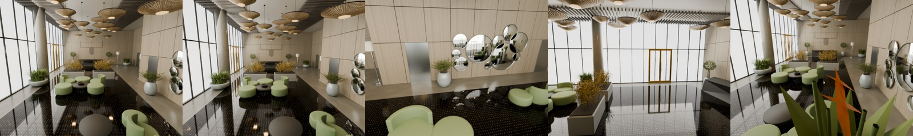
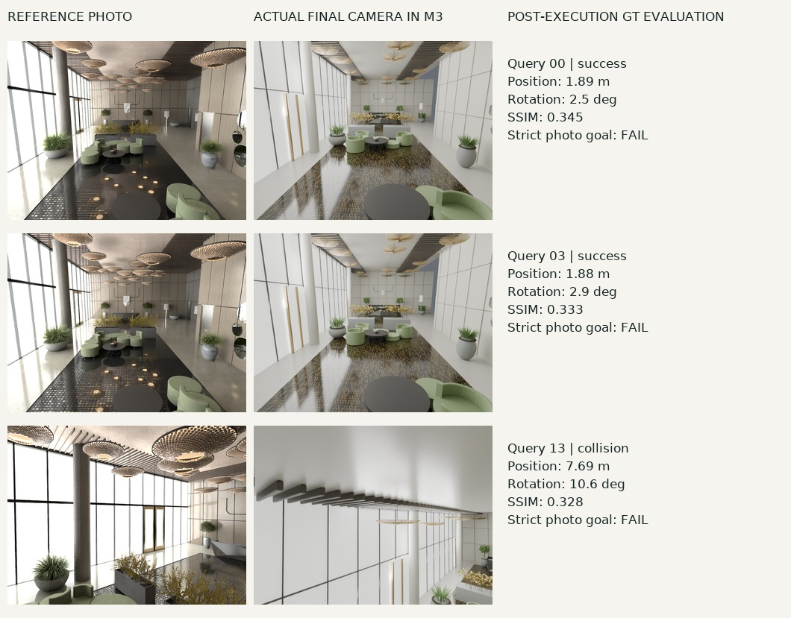

# When the map becomes a program

## A measured experiment with GPT‑6 Astra, Blender, and executable 3D worlds

Could a map also be a design file, a geometric measurement, and a robot's working environment?

We gave GPT‑6 Astra images and different amounts of geometric evidence, then used Blender as its construction and rendering tool. The resulting scenes contain editable geometry, materials, named elements, spatial relations, cameras, and collision proxies. A shared artifact connects visual interpretation, measured constraints, scene editing, and simulated action.

Two findings coexist. **A general visual coding model can turn observations into structured, executable assets. It also inherits localization errors and can build plausible structures in the wrong places.** With ground-truth camera poses, mean model-to-GT surface distance was 6.9 cm. With this capture's OpenVINS poses, it was 45.9 cm. The latter scene supported some G1 navigation, but no accurate drone rephotography.

This is one static simulated lobby, with one engineering run per method and an unequal historical budget for the RGB-only model. It exposes useful mechanisms and failures; it does not establish cross-scene superiority or industry replacement.

## Four paths from one capture

World Lobby provides approximately 360 seconds of synthetic observations: 8,999 RGB frames at 25 Hz, 1280×960 pixels, and 89,999 synchronized IMU samples at 250 Hz. Taking every 50th RGB frame gives 180 modelling views.

Fresh Astra sessions independently constructed M2, M3, and M4 using method-specific packets. Builders and independent verifiers could inspect their permitted inputs and generated scenes, but not GT geometry or evaluation results. M4 alone received GT camera poses. Historical M1 remained frozen.

| Method | Available observations | Geometric evidence | Scene construction |
|---|---|---|---|
| M1 / visual | 180 sampled RGB images | Visually inferred dimensions | Astra calls Blender |
| M2 / ViPE | Full video; sampled measurements | ViPE poses and near-metric depth | Astra calls Blender |
| M3 / inertial | Video, IMU, calibration | OpenVINS metric poses → MapAnything depth | Astra calls Blender |
| M4 / pose oracle | Video and GT camera poses | GT poses → MapAnything depth | Astra calls Blender |

**M1 asks how far visual interpretation goes.** Without measured depth or camera motion, its dimensions have no recovered metric scale. Display and shape evaluation use one disclosed GT-assisted Sim(3) registration, with scale approximately 0.690, derived from four frozen presentation-camera associations.

**M2 adds measured video geometry.** ViPE produced cameras and depth for all 8,999 frames; Astra used the corresponding sampled outputs. Near-metric depth is an empirical prediction, not a scale guarantee.

**M3 adds inertial constraints.** OpenVINS consumes calibrated, synchronized camera and IMU observations. MapAnything receives RGB, intrinsics, and its metric cam2world poses. Initialization began around 8.6 seconds, leaving 175 of the 180 sampled poses. Those missing inputs remain missing.

**M4 removes estimated-pose error.** It receives camera answers, but no GT depth, mesh, or object inventory. This is a diagnostic condition, not a deployable method or a theoretical upper bound on scene quality.

MapAnything used joint four-view windows with overlap two; an eight-view attempt exceeded memory and is excluded. A fixed centrality rule resolves repeated outputs, and pose-conditioned fusion uses the supplied camera frame. We also evaluate B1, ViPE+TSDF, and B2, calibrated RGB-only MapAnything+TSDF. Supplementary B2p fuses exactly the OpenVINS+MapAnything measurements supplied to M3. Four scene-building routes plus two primary fusion baselines make **six main systems**.

## A scene program, with explicit limits

The common loop is inspect, inventory, constrain, code, execute, render, review, and revise. New runs allow at most five revisions and 60 inspection renders; M2, M3, and M4 used 25, 15, and 20 renders respectively. Independent reviews led to repairs of furniture intersections, surface orientation, missing objects, and collider coverage. Remaining position and detail errors stayed in the frozen artifacts.

Named elements can be selected, edited, or queried. Their names are generated interpretations, not semantic accuracy measurements. M3's 259 elements include 195 trim or structural-detail elements; they are not 259 verified physical object instances. We have not independently annotated object correspondence.

M3 supplies 52 hard collision proxies. Unknown regions and vegetation exclusions constrain planning without becoming physical walls. Mass, friction, hidden joints, and material response are not independently recovered from this video. Execution under stated assumptions is a narrower claim than physical fidelity.

## Five fixed views

Rows are keyframes 0, 36, 72, 108, and 144; columns are M1, M2, M3, and original simulator RGB. Each row uses the same target camera and intrinsics after one global registration, without per-image fitting.

M1's black frame 108 remains visible. It is a camera/model coverage failure, not an image to replace with a flattering viewpoint. These images reproduce modelling views; they do not establish held-out-image generalization.

Direct fusion retains observed colors as well as holes and ghost geometry:

## Four measurements, not one score

Camera translation uses ATE RMSE; rotation uses angular RMSE. Metric and near-metric methods receive a single global SE(3) alignment, inherited by their models without ICP. M1's GT-assisted Sim(3) is explicitly separate. Depth is optical-axis Z; AbsRel averages absolute relative error over valid predictions inside an independently defined GT domain.

| System | ATE (m) ↓ | Rotation (°) ↓ | Native depth AbsRel ↓ | Model depth AbsRel ↓ |
|---|---|---|---|---|
| M1 · RGB / Sim(3)† | — | — | — | 21.68% |
| M2 · ViPE + Astra | 0.118 | 0.312 | 7.38% | 10.58% |
| M3 · VIO + MapAnything + Astra | 2.595 | 1.116 | 26.12% | 32.00% |
| M4 · GT pose + MapAnything + Astra | GT input | GT input | 10.68% | 7.54% |
| B1 · ViPE + TSDF | 0.118 | 0.312 | 7.38% | 13.03% |
| B2 · MapAnything + TSDF | 0.791 | 0.735 | 18.41% | 16.81% |

Model depth is evaluated at all 180 GT cameras. Native M3 depth retains its initialization gap. AbsRel must be read together with coverage:

| System | Sampled pose coverage | Native depth coverage | Model depth coverage |
|---|---|---|---|
| M1 | — | — | 99.71% |
| M2 | 100.00% | 100.00% | 99.40% |
| M3 | 97.22% | 95.91% | 99.19% |
| M4 | — | 98.57% | 99.87% |
| B1 | 100.00% | 100.00% | 94.75% |
| B2 | 100.00% | 98.37% | 97.06% |

The downloadable report includes RMSE, δ1, and MAE with a 30 m penalty for each missing prediction. On the common 175-frame subset, native depth AbsRel is 7.36% for M2, 26.12% for M3, 10.47% for M4, and 18.36% for B2.

Geometry uses 100,000 area-sampled model points and exact nearest GT triangles. The reverse observed-GT distance samples fixed GT image-ray hits: it is observation-weighted, not surface-area-weighted. Whole-building reverse distances, including unobserved structures, are separately retained in the raw reports.

| System | Model → GT (m) ↓ | Observed GT → model (m) ↓ | PSNR (dB) ↑ | SSIM ↑ |
|---|---|---|---|---|
| M1 | 0.306 | 0.337 | 9.48 | 0.263 |
| M2 | 0.182 | 0.195 | 12.20 | 0.342 |
| M3 | 0.459 | 0.736 | 10.06 | 0.265 |
| M4 | 0.069 | 0.074 | 12.59 | 0.344 |
| B1 | 0.453 | 0.211 | 15.57 | 0.457 |
| B2 | 0.470 | 0.395 | 13.72 | 0.370 |

RGB scores use the five input views at 640×480, with Lanczos downsampling of GT and no color fitting. They mix geometry, materials, exposure, and renderer differences. B1 scores higher on input-view appearance, while M4 has lower geometric distance. Those objectives are distinct.

The paired M3/B2p comparison also resists a single winner. Astra reduces model-to-GT distance from 1.032 m to 0.459 m and rendered-depth AbsRel from 64.79% to 32.00%. But observed-GT-to-model distance increases from 0.676 m to 0.736 m. Object construction can suppress noisy surfaces while omitting observed ones.

Relative error is clipped at 1.0 for display; teal marks missing or invalid predictions.

## Pose errors propagate

M2 and B1 share ViPE cameras; M3 and B2p share OpenVINS; M4 uses the GT path. M1 has no native estimated trajectory. A later RGB-COLMAP diagnostic is not an Astra output. Drawing six independent estimated curves would misrepresent the pipelines.

Increasing OpenVINS history from 11 to 31 improved early behavior in this slow orbit without fixing mid-sequence drift. Under first-pose alignment, position error is approximately 1.02 cm at 60 seconds and 6.79 m at 180 seconds. The main table instead reports whole-sequence best rigid alignment, giving 2.595 m ATE. These are different diagnostic definitions.

Replacing estimated poses with GT poses reduces final-model depth AbsRel from 32.00% to 7.54%. Pose quality is an important bottleneck here. Because M3 and M4 are separate single agent runs, their difference is not a noise-free causal estimate.

Twenty supplementary views are deterministic perturbations of the same simulated trajectory. Each uses 5,000 fixed random rays (seed 23) cast directly into the independent GT triangle mesh, with the same cameras and rays for every frozen model. This tests same-scene novel-pose depth, not a new scene or independent capture. Legacy rendered Z failed numerical BVH validation and is excluded; novel-view RGB is unscored because of renderer differences.

| System | Novel depth AbsRel ↓ | RMSE (m) ↓ | Coverage | Penalized MAE (m) ↓ |
|---|---|---|---|---|
| M1 | 19.45% | 2.195 | 99.66% | 1.399 |
| M2 | 10.39% | 1.186 | 99.42% | 0.783 |
| M3 | 30.58% | 2.397 | 99.25% | 2.035 |
| M4 | 7.47% | 1.146 | 99.88% | 0.465 |
| B1 | 12.92% | 1.512 | 94.84% | 2.300 |
| B2 | 16.23% | 1.710 | 96.96% | 1.972 |
| B2p | 61.97% | 5.548 | 89.13% | 7.067 |

[Independent BVH report](results/evaluation/novel_depth/report.json)

## Put the scene to work

Both tasks use the frozen M3 scene, even though other methods have better geometry. Planners read reconstructed objects, cameras, and collision geometry. Controllers receive simulator state for self-localization; this isolates some mapping effects and is not end-to-end visual autonomy.

### Drone: retrieve a view, fly, and attempt the photograph

Twenty uniformly spaced original simulator RGB images serve as references, with target poses withheld from retrieval and planning. DINOv2 ranks 29 M3 render candidates. A planner checks the top five for reachability, then MuJoCo simulates a 1 kg six-degree-of-freedom quadrotor with four bounded thrust actuators. The camera uses an ideal stabilized gimbal. This version has no continuous image-based pose refinement.

**15/20 flights reached a retrieved candidate without collision; 5/20 collided. Accurate rephotography succeeded in 0/20.** Strict success requires collision-free execution, position error ≤0.10 m, and rotation error ≤5°. The relaxed thresholds, ≤0.25 m and ≤10°, also give 0/20. Mean final GT position and orientation errors are 3.38 m and 22.21°.

Candidate arrival does not establish correct retrieval or agreement with the source world. These are known-scene mapping images, not held-out reference photographs. All 20 outcomes, including collisions, remain available.

### Unitree G1: find the described object

We use Unitree's public 12-DOF walking policy in MuJoCo. A transparent constrained-English parser handles category, attribute, and near relations against the generated object inventory. Thirty instructions are six paraphrases of each of five target families, not thirty independent goals.

**18/30 episodes reached their declared model-world approach goal; 12/30 failed during planning.** Table, plant, and reception-desk queries succeeded 6/6 each. Window-side green-chair and round-mirror queries succeeded 0/6. Executed episodes recorded no falls, collisions, or timeouts. Conservative colliders, a 0.47 m planning radius, and unknown-space exclusions blocked the other goals.

Success concerns navigation to the object selected by this parser, without an independent visual or instance-identity confirmation. Videos replay actual policy trajectories. Planning failures have static diagnostics because no physical episode started.

**A static GT audit exposes the transfer gap.** After applying the fixed global registration, all 20 drone trajectories contain a center sample within 0.30 m of the original GT surface. G1 foot proxies lie roughly 0.33–0.71 m below the reference GT floor. These are surface-distance and height diagnostics without inside/outside classification or GT dynamics replay. They are neither confirmed collision counts nor evidence of successful transfer.

The next experiment should separately improve pose estimation, object correspondence, geometric uncertainty, and closed-loop visual control, then test the reconstructed map in the original GT dynamics environment.

## What could change

For **3D tools**, observations and intent become an asset-authoring interface. A model writes a scene program; measurements and rendering constrain it. Object edits, variations, and task-specific environments can share that program. We demonstrate this interface without measuring labor or cost savings.

For **SLAM**, a map's downstream role expands. Cameras, surfaces, objects, and relations can become editable and executable assets. Localization, loop closure, scale, observability, and uncertainty remain essential. M3 demonstrates that visual code generation does not automatically repair geometric estimation.

For **embodied intelligence**, object structure supplies a query interface and collision layers connect planning to dynamics. A useful next step is to expose uncertainty to the agent: which surfaces were measured, which were completed, and which actions require another observation.

This direction has substantial precedent. Hydra builds hierarchical scene graphs; ConceptFusion and VLMaps support visual-language mapping and navigation. SceneScript and Real2Code study structured or code-based reconstruction. Holodeck generates embodied environments from language. ViPE, MapAnything, and VGGT estimate geometry; 3D Gaussian Splatting emphasizes view synthesis. Lab Kitchen Twin and LiteReality-Agent are closely related public engineering demonstrations, not independent quantitative baselines here.

The long-term question is concrete: **can modelling, measurement, and action collaborate around the same inspectable scene program?** This experiment provides a working starting point and failures that make the next tests necessary.

## Evidence and reproduction

[Machine-readable results](results/final_evaluation.json) · [CSV](results/final_evaluation.csv) · [Reproduction guide](docs/REPRODUCIBILITY.md) · [Source records](references/research_sources.json) · [Progress log](docs/PROGRESS.md)

Inputs and frozen artifacts retain hashes. New work lives in an isolated directory; previous code and results remain read-only sources. GT geometry comes from the metric scene wrapper with its 0.01 scale transform, not the unscaled source asset.

[GPT-6 Astra](https://developers.openai.com/api/docs/models/gpt-6-astra) · [ViPE](https://arxiv.org/abs/2508.10934) · [MapAnything](https://github.com/facebookresearch/map-anything) · [OpenVINS](https://docs.openvins.com/) · [3D Gaussian Splatting](https://repo-sam.inria.fr/fungraph/3d-gaussian-splatting/) · [VGGT](https://github.com/facebookresearch/vggt) · [Hydra](https://github.com/MIT-SPARK/Hydra) · [ConceptFusion](https://concept-fusion.github.io/) · [VLMaps](https://github.com/vlmaps/vlmaps) · [SceneScript](https://arxiv.org/abs/2403.13064) · [Real2Code](https://arxiv.org/abs/2406.08474) · [Holodeck](https://github.com/allenai/Holodeck) · [Lab Kitchen Twin](https://frank-zy-dou.github.io/kitchen-twin/) · [LiteReality-Agent](https://github.com/LiteReality/LiteReality-Agent)
